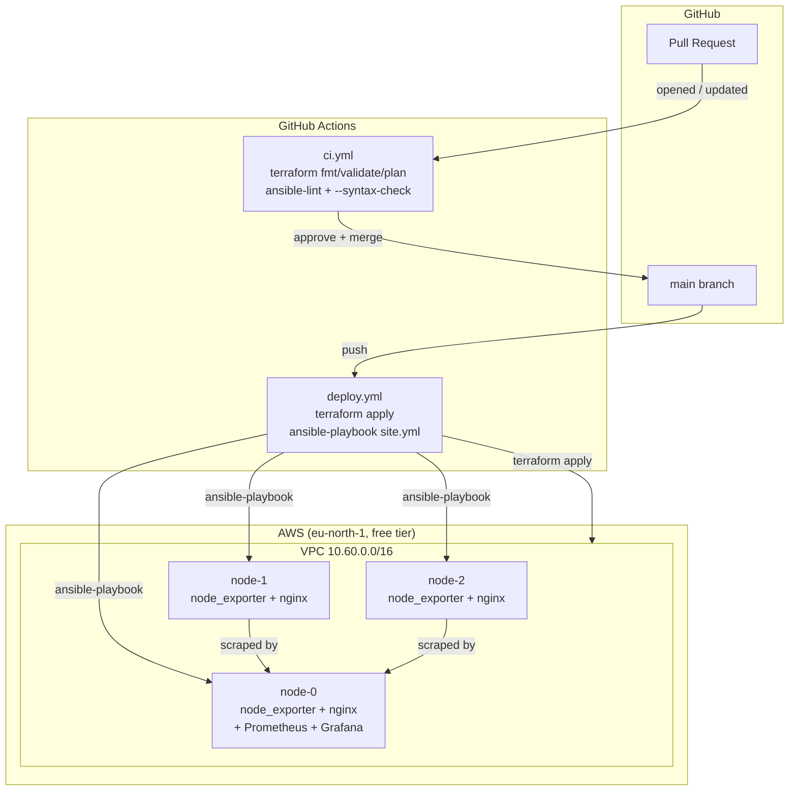

# Mini Compute Fleet

A small, honest CI/CD pipeline for provisioning and configuring Linux VMs:
**Terraform** brings up the fleet, **Ansible** configures it, and **GitHub
Actions** gates every change with a dry-run on PR and an auto-apply on
merge to `main`. It's a 3-node demo, not a production fleet — see
[What breaks at 1000x scale](#what-breaks-at-1000x-scale) for the gap
between the two.

This exists to demonstrate one specific loop end to end: **propose a
change → CI validates it → merge → it rolls out to real machines
automatically** — the same loop behind "provisioning through automated
maintenance" and "test and deploy configuration changes to production" in
infrastructure job descriptions.

## Architecture



| Layer | Tool | What it does |
|---|---|---|
| Provisioning | Terraform (AWS provider) | VPC, subnet, security group, 3x EC2 `t3.micro`, and a `local_file` that regenerates the Ansible inventory from live instance IPs on every apply |
| Configuration | Ansible | 5 idempotent roles: `common`, `ssh_hardening`, `node_exporter`, `webapp`, `monitoring_server` |
| CI gate (PR) | GitHub Actions (`ci.yml`) | `terraform fmt/validate/plan` + `ansible-lint` + `ansible-playbook --syntax-check`, always run, no cloud credentials required |
| CD (merge to `main`) | GitHub Actions (`deploy.yml`) | `terraform apply` then `ansible-playbook site.yml` against the real fleet, gated on repo secrets being configured |
| Monitoring | Prometheus + Grafana | `node_exporter` on every node; Prometheus + Grafana on `node-0`, scraping the other two over the private security-group-restricted network |

## Repo layout

```
terraform/            VPC, security group, 3x EC2 instance, inventory generator
ansible/
  roles/
    common/            baseline packages, service user, UFW, unattended-upgrades
    ssh_hardening/      hardened sshd_config (no root login, no password auth)
    node_exporter/      Prometheus node_exporter as a systemd service
    webapp/             nginx + a status page proving config landed
    monitoring_server/  Prometheus + Grafana on the designated monitoring node
  playbooks/site.yml
monitoring/grafana/dashboards/fleet-health.json   fleet CPU/mem/disk/net dashboard
.github/workflows/
  ci.yml       runs on every PR
  deploy.yml   runs on merge to main
scripts/       bootstrap.sh / destroy.sh for running the same steps locally
```

## Running it yourself

This is a **3-node demo fleet on AWS free tier** — running it costs you
nothing on a new/eligible account, but it does provision real EC2
instances under your own AWS account. Nothing in this repo can run
against your AWS account without you supplying your own credentials.

1. **Prerequisites**: an AWS account, an existing EC2 key pair in your
   target region, Terraform >= 1.5, Ansible >= 2.16.
2. **Configure**:
   ```bash
   cp terraform/terraform.tfvars.example terraform/terraform.tfvars
   # edit terraform.tfvars: set admin_cidr to YOUR IP/32, and ssh_key_name
   ```
3. **Provision + configure** (mirrors what `deploy.yml` does in CI):
   ```bash
   ./scripts/bootstrap.sh
   ```
   This runs `terraform apply`, waits for SSH, then runs
   `ansible-playbook playbooks/site.yml`.
4. **Look around**: SSH commands and the Grafana URL are in
   `terraform output`. Grafana's first-login default is `admin` / `admin`.
5. **Tear down** when you're done so free-tier hours don't quietly run out:
   ```bash
   ./scripts/destroy.sh
   ```

### Wiring up the CI/CD gate on your own fork

`deploy.yml` no-ops until these repo secrets exist (Settings → Secrets and
variables → Actions): `AWS_ACCESS_KEY_ID`, `AWS_SECRET_ACCESS_KEY`,
`ADMIN_CIDR`, `SSH_KEY_NAME`, `SSH_PRIVATE_KEY`. Without them, `ci.yml`
still runs `terraform fmt/validate` and `ansible-lint` on every PR — the
static checks don't need a live account.

## What breaks at 1000x scale

Being upfront about where this demo would fall over at real fleet size,
and what I'd actually change:

- **Local Terraform state → remote state with locking.** One state file
  on disk works for one person and 3 nodes. At scale, two people (or two
  CI runs) applying at once will corrupt or race the state. Fix: S3
  backend + DynamoDB lock table, one state file per environment.
- **Monolithic `aws_instance` count → immutable images + ASGs.** Hand-configuring
  3 long-lived boxes with Ansible is fine here; at 1000 nodes, config drift
  between "what Ansible thinks it did" and "what's actually on the box"
  becomes the dominant source of incidents. Fix: bake AMIs with Packer +
  the same Ansible roles, run instances in autoscaling groups, replace
  rather than patch.
- **One monitoring node → a real observability stack.** A single
  Prometheus scraping everything doesn't survive past a few hundred
  targets, and it's a single point of failure for visibility. Fix:
  federated/sharded Prometheus or a managed TSDB (Thanos, Mimir, or a
  hosted equivalent), plus alerting (Alertmanager) instead of "look at the
  dashboard."
- **`terraform apply -auto-approve` on every merge → progressive rollout.**
  Auto-applying to the whole fleet on merge is fine for 3 nodes; at scale
  a bad change should hit a canary subset first, with automatic rollback
  on failed health checks, not the entire fleet at once.
- **Ansible pull-based, one playbook run → drift detection + enforcement.**
  Ansible only converges state when you run it. At scale you want a
  reconciliation loop (e.g. Ansible in pull mode, or a config daemon) that
  continuously re-applies desired state, plus alerting when a host has
  drifted for longer than expected.
- **Security group open to one admin CIDR → a real access model.** Fine
  for a demo run by one person; at scale that's a bastion host / SSM
  Session Manager (no inbound SSH port at all) plus per-engineer IAM,
  not a shared CIDR allowlist.
- **No secrets management.** Everything here that's sensitive
  (`terraform.tfvars`, the SSH private key, AWS creds) is a local file or
  a GitHub Actions secret. At scale, that's Vault or AWS Secrets Manager
  with short-lived credentials, not long-lived static keys sitting in CI.

## Honesty note

This is a demo pipeline proving the mechanics (IaC provisioning → config
management → CI/CD gate → monitoring) work together end to end on a small
fleet — not a production system, and I'm not presenting it as one. "3-node
fleet," not "large-scale."

## License

MIT — see [LICENSE](LICENSE).
